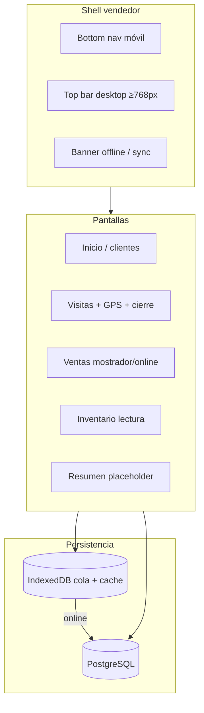
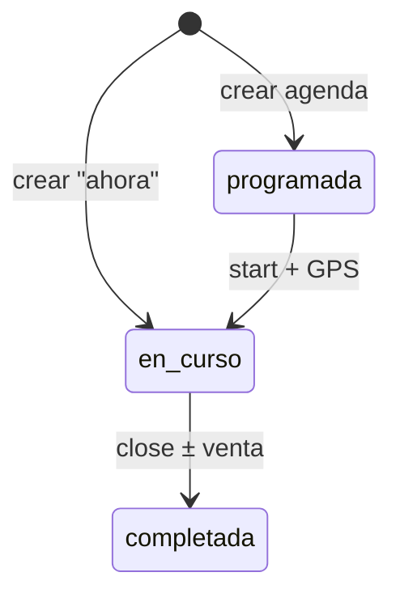
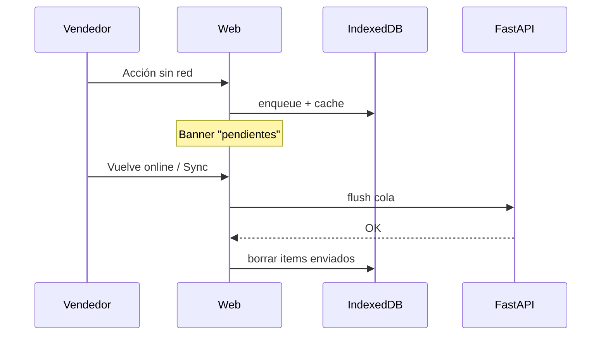

# Fase 1 — Vendedor usable (implementación detallada)

**Estado:** cerrada en lo esencial (SF-1.1 → SF-1.10 + fixes).  
**Stack:** `mvp/` FastAPI + PostgreSQL · `web/` React + Vite + TypeScript.  
**Marca en código:** aún “Bitácora Campo”; dominio comercial explorado: **enrutas.cc**.

---

## Mapa mental de la Fase 1

---

## SF-1.1 — Shell UX vendedor

### Objetivo
App móvil con navegación inferior fija, misma estética que el export.

### Qué se hizo
- Layout `SellerShell` + `BottomNav` (Inicio, Visitas, Ventas, Inventario, Resumen).
- Tokens CSS del export (cream / verde / coral).

### Cómo
| Pieza | Ruta |
|-------|------|
| Shell | `web/src/layout/SellerShell.tsx` |
| Tabs | `web/src/layout/BottomNav.tsx` → luego `sellerNav.ts` |
| Estilos | `web/src/styles/tokens.css`, `base.css` (`.tabbar`) |

### Cómo probar
Abrir web &lt;768px de ancho → barra inferior visible; cambiar de pestaña.

---

## SF-1.1b — Nav desktop

### Objetivo
En pantallas anchas, top bar en lugar de bottom nav.

### Qué se hizo
- `TopNav` con mismas rutas + usuario + Salir.
- CSS `@media (min-width: 768px)`: oculta `.tabbar`, muestra `.topbar`.
- Tabs compartidos en `sellerNav.ts`.

### Cómo
| Pieza | Ruta |
|-------|------|
| Top bar | `web/src/layout/TopNav.tsx` |
| Tabs | `web/src/layout/sellerNav.ts` |
| CSS | `web/src/styles/base.css` (bloque `.topbar`) |

### Cómo probar
Ensancha la ventana ≥768px → top bar; achica → bottom nav.

---

## SF-1.2 — Clientes (alta + búsqueda)

### Objetivo
Cartera con RIF **o** CI (nunca ambos).

### Qué se hizo
- Lista/búsqueda en Inicio.
- Formulario alta con toggle RIF/CI.
- API `GET/POST /api/clients` con validación exclusividad.

### Cómo
| Pieza | Ruta |
|-------|------|
| UI | `web/src/pages/HomePage.tsx`, `ClientForm.tsx` |
| API | `mvp/app/routers/clients.py`, `schemas.ClientCreate` |
| Modelo | `Client.rif`, `Client.ci`, `address`, `lat/lng` (coords ya en DB) |

**Nota:** dirección escrita sí en formulario; **pin en mapa al alta** quedó pendiente (ver `NOTAS-PRODUCTO.md`).

---

## SF-1.3 — Ciclo de visitas

### Objetivo
Estados `programada` → `en_curso` → `completada`.

### Qué se hizo
- Lista de visitas, crear ahora/programada, iniciar, cerrar.
- Endpoints create / start / close.

### Cómo
| Pieza | Ruta |
|-------|------|
| UI | `web/src/pages/VisitsPage.tsx` |
| API | `mvp/app/routers/visits.py` |
| Servicio cierre | `mvp/app/services/visits.py` |

---

## SF-1.4 — GPS inicio/cierre

### Objetivo
Capturar posición al iniciar/cerrar visita.

### Qué se hizo
- `getCurrentPosition` con opciones de precisión.
- Guardado en visita (`latitude`, `longitude`, `gps_accuracy_m`).
- Aviso HTTPS / mock GPS para desarrollo sin secure context.

### Cómo
| Pieza | Ruta |
|-------|------|
| Helper | `web/src/lib/gps.ts` |
| HTTPS Vite | `npm run dev:https` + `@vitejs/plugin-basic-ssl` |

---

## SF-1.5 — Trail GPS en curso

### Objetivo
Muestras ligeras mientras la visita está `en_curso`.

### Qué se hizo
- `watchPosition` + `POST /api/visits/{id}/gps-points`.
- Hook `useVisitGpsTrail`.
- Modelo `VisitGpsPoint` (`start` / `watch` / `end`).

### Cómo
| Pieza | Ruta |
|-------|------|
| Hook | `web/src/hooks/useVisitGpsTrail.ts` |
| API | `mvp/app/routers/evidence.py` |

---

## SF-1.6 — Skip GPS + foto + alertas

### Objetivo
No bloquear el cierre sin GPS; exigir foto/motivo; alertar precisión/lejanía.

### Qué se hizo
- Flags `gps_skipped`, `gps_skip_reason`, `photo_evidence`.
- Alertas: `gps_skipped`, `photo_only`, `gps_low_accuracy`, `gps_far`.
- Compresión de foto en cliente (fix de celular demasiado grande en base64).

### Cómo
| Pieza | Ruta |
|-------|------|
| Cierre UI | `web/src/components/CloseVisitSheet.tsx` |
| Compresión | `web/src/lib/imageEvidence.ts` |
| Lógica | `close_visit_with_optional_sale` en `services/visits.py` |
| Inbox API | `GET /api/alerts` |

**Fix relacionado:** sin compresión, “Confirmar cierre” no llegaba al API.

---

## SF-1.7 — Venta al cerrar visita + inventario

### Objetivo
Orden ligada a visita; descontar stock; ver inventario.

### Qué se hizo
- En cierre: sin venta / con venta, cantidades, USD/VES.
- `apply_sale_to_inventory` decrementa `Product.stock`.
- Pantalla Inventario solo lectura.

### Cómo
| Pieza | Ruta |
|-------|------|
| UI cierre | `CloseVisitSheet.tsx` |
| Inventario | `web/src/pages/InventoryPage.tsx` |
| Origen venta | `SaleOrigin.visita` (hardcoded al cerrar visita) |

---

## SF-1.8 — Venta sin visita

### Objetivo
Órdenes `mostrador` / `online` sin `visit_id`.

### Qué se hizo
- `GET/POST /api/sales`.
- Pantalla Ventas: lista + alta.
- Reutiliza descuento de stock.

### Cómo
| Pieza | Ruta |
|-------|------|
| Router | `mvp/app/routers/sales.py` |
| Servicio | `mvp/app/services/sales.py` |
| UI | `web/src/pages/SalesPage.tsx` |
| Schema | `SaleCreate` (rechaza `origin=visita`) |

---

## SF-1.9 — Offline (cola + cache)

### Objetivo
Trabajar sin red: cache catálogo; encolar visita/cierre/venta; sync al volver.

### Qué se hizo
- IndexedDB: cache clientes/productos + cola + visitas locales.
- Banner sync en el shell.
- Visita local offline → al cerrar va a `POST /api/sync/offline-visits`.
- Cierre de visita ya sincronizada → cola `close_visit`.
- Venta standalone → cola `create_sale`.
- Sync ampliado con foto / skip GPS.

### Cómo
| Pieza | Ruta |
|-------|------|
| IDB | `web/src/lib/offlineDb.ts` |
| Cola | `web/src/lib/offlineQueue.ts` |
| Banner | `web/src/components/OfflineBanner.tsx` |
| Sync API | `mvp/app/routers/sync.py` |

---

## SF-1.10 — Mapa evidencia (Leaflet)

### Objetivo
Ver trail GPS de una visita sobre OpenStreetMap.

### Qué se hizo
- Dependencia `leaflet`.
- `VisitMapSheet`: marcadores inicio/trail/cierre + polilínea.
- Botón **Ver trail** en visita activa e historial.
- Fallback al lat/lng de la visita si no hay puntos.

### Cómo
| Pieza | Ruta |
|-------|------|
| Mapa | `web/src/components/VisitMapSheet.tsx` |
| CSS | `.visit-map` en `base.css` |
| Datos | `GET /api/visits/{id}/gps-points` |

**Pendiente visual acordado:** pin de **cliente/PDV** distinto al del **vendedor/trail** (ver notas).

---

## SF-1.12 — Editar cliente + pin

### Objetivo
Poder corregir datos y añadir/mover el pin PDV en clientes ya creados.

### Qué se hizo
- `PATCH /api/clients/{id}` con los mismos campos del alta.
- Formulario en modo edición desde la ficha (**Editar datos y pin**).
- Tras guardar, vuelve a la ficha actualizada.

### Cómo
| Pieza | Ruta |
|-------|------|
| API | `mvp/app/routers/clients.py`, `schemas.ClientUpdate` |
| Form | `ClientForm` (`initialClient` / `onSaved`) |
| Ficha | `ClientDetailSheet` → botón editar |
| Cliente API web | `updateClient()` en `api.ts` |

---

## SF-1.11 — Pin PDV en cliente + distinción en mapa

### Objetivo
Dirección escrita + pin del local; en el mapa de visita, PDV ≠ trail del vendedor.

### Qué se hizo
- Alta de cliente: mapa tocable/arrastrable + «Usar mi GPS» + quitar pin.
- Envía `latitude` / `longitude` al API (ya existían en el modelo).
- Lista de clientes muestra coords si hay pin.
- **Ver trail:** marcador PDV verde (cuadrado) vs puntos vendedor (círculos coral/oscuro/rojo) + leyenda.
- Polilínea del trail en coral.

### Cómo
| Pieza | Ruta |
|-------|------|
| Form + GPS | `web/src/components/ClientForm.tsx` |
| Mapa picker | `web/src/components/ClientLocationPicker.tsx` |
| Iconos | `web/src/lib/mapMarkers.ts` |
| Evidencia | `web/src/components/VisitMapSheet.tsx` |
| Tipos | `Client.latitude/longitude` en `types.ts` / `ClientCreateInput` |

### Cómo probar
Ver checklist SF-1.11 en `docs/SUBFASES.md`.

---

## Fixes / extras en el camino

| Tema | Qué | Commit típico |
|------|-----|----------------|
| Foto cierre | Compresión JPEG antes de enviar | `fix: comprimir foto…` |
| HTTPS local | `dev:https` para GPS real en celular | Vite basic-ssl |
| Mock GPS | Desarrollo sin HTTPS | `lib/gps.ts` |
| Arranque | Guía post-apagón | `docs/ARRANQUE_LOCAL.md` |

---

## Usuarios demo

Tras `python seed.py` en `mvp/`:

| Email | Rol | Password |
|-------|-----|----------|
| `marina@bitacora.local` | vendedor | `demo1234` |
| `supervisor@bitacora.local` | supervisor | `demo1234` |
| `admin@bitacora.local` | admin | `demo1234` |

---

## Cómo verificar Fase 1 completa (smoke)

1. `docs/ARRANQUE_LOCAL.md` → DB + API + Web HTTPS.
2. Login marina → clientes en Inicio.
3. Visita ahora → GPS → trail → cerrar con/sin venta / omitir GPS + foto.
4. Ventas → orden mostrador.
5. Inventario → stock bajó.
6. Offline en DevTools → visita/venta en cola → Sync.
7. **Ver trail** → mapa con puntos.

---

*Documento vivo: al tocar Fase 1 de nuevo, añadir una sección “Cambios posteriores” al final.*
