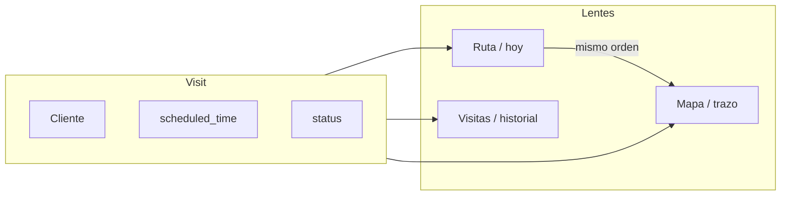

# Fase 4 — Homogeneizar UI móvil

**Estado:** SF-4.0–4.3 hechas. Siguiente: SF-4.4 Inicio vendedor.  
**Fecha de arranque:** 2026-08-13  
**No toca:** `startVisit`, `createVisitSale`, paleta EnRutas, Overlay Modal vs SideSheet.

Diagnóstico contra grabaciones en `~/Video/`:

| Video | Qué cubre |
|-------|-----------|
| `video_2026-08-13_12-17-30_enrutas.mp4` | Supervisor móvil (Inicio → Ruta → Visitas → Clientes → Más → Catálogo → Inventario → Mapa) |
| `video_2026-08-13_12-38-52_enrutas.mp4` | Vendedor: Inicio, Visitas, Ventas (OV + wizard sin visita), Inventario, Clientes, cámara de comprobante |
| `video_2026-08-13_12-51-37_enrutas.mp4` | Recorrido / mapa vendedor (`/app/ruta`) vs lista |
| `video_2026-08-13_12-56-31_enrutas.mp4` | Wizard visita 1→2→3 (productos → pago → resumen → OV-39) |

Referencia de densidad (estructura, no paleta): TuzonaMarket (fila operativa) y Farmatodo checkout (una decisión por bloque). Tokens: teal `--primary`, coral `--accent`, cream `--background`. No copiar verde Tuzona ni azul Farmatodo.

---

## Cómo se trabaja esta fase

1. Abrir **solo** la SF de turno (no mezclar).
2. El agente implementa contra esta spec + `.cursor/rules/ui-enrutas.mdc` + `.cursor/rules/ui-movil.mdc`.
3. Revisas en el **teléfono** (Chrome, ~360–412 px). Si puedes, 20–40 s de video.
4. Commit `SF-4.x: …`. **Tú** haces push.
5. Se rellena «Qué se hizo / Cómo probarlo» aquí y se marca en `docs/SUBFASES.md`.
6. Recién entonces la siguiente SF.

Si una SF pide “arreglar y un PoC de exploit”: solo el arreglo.

---

## Qué modelo usar (Claude bloqueado en la región)

Claude Opus es el que más “gusto visual” tiene; no está disponible. Orden práctico:

| Trabajo | Modelo | Por qué |
|---------|--------|---------|
| Spec, review, “¿esto coincide con el video?” | **Grok 4.6** (este chat) | Diagnóstico y contrato; no inventa paleta |
| UI visual (chrome, fila, wizard, densidad) | **GPT-5.6 Terra** (o Sol si Terra no aparece) | Lo más cercano a Claude para layout y CSS |
| Parche mecánico con spec cerrada (foto, `$$`, sort, polyline) | **Composer** (no Fast) | Multi-archivo fiel a instrucciones |
| Evitar | Composer Fast, Grok Fast | Recortan densidad y “arreglan de más” |

Prompt mínimo al cambiar de modelo:

> EnRutas tokens. No toques `startVisit` / `createVisitSale`. Una SF de `docs/implementacion/FASE-4-UI-MOVIL.md`. No copies Tuzona/Farmatodo. Adjunta el video de esa SF si existe.

---

## Contrato (no negociable)

1. **Una fila de visita** en Inicio (agenda), Visitas, Orden del día del mapa, Ruta supervisor. Misma pieza. Ficha al tap. Sin lat/lng ni GPS en la fila.
2. **Chrome corto.** En móvil: no apilar breadcrumb + eyebrow + H1 + blurb + filtros antes del contenido. Una línea de contexto + lista o mapa.
3. **Un `+`.** FAB **o** botón header, no los dos. El FAB no tapa En curso / Iniciar / Confirmar.
4. **Ruta gráfica = ruta agendada.** Orden = `scheduled_time` (y si no hay hora, orden de asignación). Vecino más cercano es opcional y **aparte**, no el trazo oficial.
5. **Tres lentes, una entidad `Visit`:** Ruta = hoy para asignar; Visitas = bitácora; Mapa = el mismo día en mapa. No tres listados distintos.
6. **Foto de comprobante:** galería (sin `capture=`). Cancelar la cámara/picker **no** cierra el wizard ni borra la cotización.
7. **Agenda del día:** mañana → tarde (`scheduled_time` ASC). “Más reciente primero” solo en **Culminadas** / historial.
8. **Un signo de moneda.** `Total` + `$ 13.57`, nunca `Total $ $ 13.57`.
9. **Selects nativos de Android** no deben tapar el mapa ni la lista: usar `SelectField` / bottom sheet.
10. Fechas en **es-VE**, no `08/13/2026`.



---

## SF-4.0 — Brújula documentada

**Estado:** hecho (este archivo + reglas + checkpoints).

### Objetivo
Dejar el contrato y las SF escritas para no re-discutir en cada chat.

### Qué se hizo
- Este documento.
- Regla `.cursor/rules/ui-movil.mdc`.
- Checkpoints en `docs/SUBFASES.md`.
- Decisiones 17–20 en `docs/DECISIONES_Y_ROADMAP.md`.

### Cómo probarlo
Abrir este archivo y la regla; el siguiente trabajo es SF-4.1, no un rediseño completo.

---

## SF-4.1 — Quemaduras (foto, wizard, `$$`)

**Estado:** hecho (2026-08-13)  
**Modelo:** Grok 4.6  
**Videos:** 12-38 (cámara techo) · 12-56 (wizard 1-2-3)

### Objetivo
Que cotizar no se pierda, que la foto salga de la galería, que el total no lleve dólar doble.

### Qué se hizo
- `PhotoDrop`: dos botones **Galería** y **Cámara** (Android no mezcla `capture` en un solo input). Cancelar cualquiera no cierra el wizard.
- Guardia `overlayGuard`: Escape + clic fantasma no tiran el modal. Escape solo cierra el overlay de encima.
- Wizard visita y venta sin visita: el formulario **no se resetea** si el modal sigue abierto.
- Totales: etiqueta **Total** + monto `$ 13.57` / `Bs …`.
- Métodos por moneda: **USD** Efectivo USD / Zelle / USDT · **Bs** Efectivo Bs / Pago móvil / Transferencia.
- **Hora de negocio = Caracas (UTC−4, sin DST).** Instants en UTC; “hoy”, filtros de día y relojes en `America/Caracas` (`web/src/lib/caracasTime.ts`, `mvp/app/timeutil.py`). Independiente de la TZ del teléfono o del servidor.

### Cómo
| Pieza | Ruta |
|-------|------|
| Guardia picker | `web/src/lib/overlayGuard.ts` |
| Escape / stack | `web/src/hooks/useOverlay.ts` |
| Backdrop/X | `Modal.tsx`, `SideSheet.tsx` |
| Foto | `PhotoDrop.tsx`, `PaymentCapture.tsx`, `CloseVisitSheet.tsx` |
| Totales | `SaleQuoter.tsx`, `QuoteDocument.tsx` |
| Wizard | `VisitSaleWizard.tsx`, `SalesPage.tsx` |

### Cómo probarlo
1. Teléfono Chrome: visita en curso → Registrar venta → Pago → **Galería** o **Cámara** (dos botones).
2. Cancelar esa captura: wizard **sigue** en paso 2 con las líneas intactas. La ficha tampoco se cierra.
3. Desktop: Galería abre archivos; Cámara puede abrir webcam o el mismo diálogo.
4. Paso 1: `Total` + `$ 13.57` (un dólar).
5. Moneda Bs: solo Efectivo Bs, Pago móvil, Transferencia. USD: Efectivo USD, Zelle, USDT.
6. Confirmar OV: visita sigue abierta.

**Responsive de esta SF:** el bug era del **navegador móvil** (cámara nativa + overlay), no del fold. Chrome corto / FAB = SF-4.2. Aquí no se cambia el layout de páginas.

---

## SF-4.2 — Chrome + FAB

**Estado:** hecho (2026-08-13)  
**Modelo:** Grok 4.6  
**Videos:** 12-17 (supervisor) · 12-38 (vendedor)

### Objetivo
El contenido (lista, mapa, Iniciar) cabe en la primera pantalla.

### Qué se hizo
- Headers &lt;900px: se ocultan eyebrow + blurb; H1 compacto. Breadcrumb del shell queda como contexto.
- Un `+`: en vendedor móvil se oculta el CTA del header (Visitas / Ventas / Clientes); el FAB abre esas mismas altas (`?nueva=1` / `?nuevo=1`).
- FAB oculto con overlay (`body.has-overlay`). Padding extra en listas vendedor y en acciones de «En curso» para no tapar botones.
- Chips en una sola fila con scroll horizontal (`Canceladas`, `Agotado`, …).
- `Cargando…` con clase `.list-loading` en listas vendedor.

### Cómo
| Pieza | Ruta |
|-------|------|
| Chrome / FAB / chips | `web/src/styles/base.css` (bloque SF-4.2) |
| Overlay esconde FAB | `useBodyScrollLock` → `body.has-overlay` |
| FAB destinos | `QuickAddFab.tsx` |
| Header CTA | `VisitsPage`, `SalesPage`, `ClientsPage` (`.header-plus-cta`) |

### Cómo probarlo
1. Pixel/Galaxy: Inicio, Visitas, Inventario, Clientes — lista o mapa visibles sin apilar eyebrow + H1 + párrafo.
2. Visitas / Ventas / Clientes: un solo `+` (el FAB). Desktop (≥900px): el botón del header, sin FAB.
3. Abrir ficha o wizard: el FAB no queda encima de Confirmar.
4. Chips: `Canceladas` / `Agotado` no se parten a dos líneas; se deslizan.

---

## SF-4.3 — Una fila de visita

**Estado:** hecho (2026-08-13)  
**Modelo:** Grok 4.6  
**Videos:** 12-38 · 12-56 (lista Visitas)

### Objetivo
La misma fila en vendedor y, luego, supervisor.

### Qué se hizo
- `VisitRow`: LED o punto · nombre PDV · hora o estado · chevron. Toda la fila abre la ficha.
- Visitas: sin cards altas, coords, GPS, Iniciar / Ver trail / Cerrar en la fila. En curso va en **Programadas** con LED (no hero duplicado).
- Orden: Programadas `scheduled_time` ASC (en curso primero, **sin asistir** después). Culminadas/Canceladas por fecha DESC.
- Chips: **Programadas · Culminadas · Canceladas**. El carrusel de fechas va **dentro** de Programadas (hoy / Todas).
- Programadas **sin asistir** (fecha ya pasó): triángulo coral, meta «Sin asistir», arriba en Hoy y Todas. Carrusel: chips grises solo de días pasados con visitas (no 30 días vacíos hacia atrás).
- Inicio (agenda) y Orden del día del mapa usan la misma fila. Tap abre ficha.
- Ficha: título = estado (`En curso` / `Programada`…); el nombre del PDV solo en el bloque de identidad. **Cerrar ficha** vs **Cerrar visita** se quedan.
- Supervisor reutiliza la fila en SF-4.8.

### Cómo
| Pieza | Ruta |
|-------|------|
| Fila | `web/src/components/VisitRow.tsx` |
| Orden | `web/src/lib/visitOrder.ts` |
| Listas | `VisitsPage`, `HomePage`, `SellerRouteMapPage` |
| Ficha | `VisitDetailSheet.tsx` (título) |

### Cómo probarlo
1. Visitas chip **Programadas**: ≥5 filas compactas. En curso con LED, no una card gorda arriba.
2. Tap abre ficha. **Iniciar** / GPS / trail viven en la ficha, no en la fila.
3. Programadas: carrusel de días; 12:00 encima de 14:00. Si hay vencidas: aviso coral, chips grises a la izquierda, listadas en Hoy.
4. Culminadas: la más reciente primero.
5. Inicio y Recorrido: misma fila; tap abre ficha.

---

## SF-4.4 — Inicio vendedor

**Estado:** pendiente  
**Modelo:** GPT-5.6 Terra  
**Video:** 12-38 (Inicio)

### Objetivo
Una historia del día, no el mismo 8/12 y 67% tres veces.

### Qué hacer
- Hero de ruta **o** KPIs, no hero + 4 tiles que repiten visitas/cobertura.
- Agenda: mismas filas que SF-4.3, orden horario, más que `slice(0,3)` o “ver todas” claro a Visitas.
- CTA al mapa grande (hoy el icono del hero es minúsculo). Ruta sigue **fuera** del tabbar.
- Copy: “Lista para mover la ruta” → neutro (“Listo para la ruta” / “Tu ruta de hoy”).
- Sin flash `0 de —` → `8/12`.
- Cartera en Inicio: no duplicar Clientes; recortar o enlazar.

### Cómo probarlo
Inicio: progreso una vez, 2–3 paradas con hora, tap al mapa obvio, sin cartera infinita debajo.

---

## SF-4.5 — Mapa = lo agendado

**Estado:** pendiente  
**Modelo:** Grok 4.6 o GPT-5.6 (lógica clara)  
**Video:** 12-51 (recorrido)

### Objetivo
El trazo y “Orden del día” son la ruta que el supervisor agendó.

### Qué hacer
- Ordenar con `scheduled_time` ASC (desempate: id / orden de asignación). **No** `orderDayRoute` greedy como trazo oficial.
- Filtro del día: visitas **programadas hoy** (más en curso/cerradas de esa agenda). No meter historial ni PDVs de otro estado porque `visited_at` cae hoy.
- Paradas sin pin: salen en la lista (“Sin pin”), no desaparecen. El polyline salta huecos.
- `fitBounds` + clustering o pines al zoom; no etiquetas permanentes que se pisan.
- Mapa más alto / edge-to-edge; leyenda corta; chrome de SF-4.2.
- Un `en_curso` a la vez en producto (si hay dos, el mapa no los une como “siguiente tramo” geográfico inventado).
- Seed demo: ruta Lara coherente (sin Kiosco Doña Carmen / duplicados de Bodega 24h en el mismo día).

### Archivos probables
`SellerRouteMapPage.tsx`, `web/src/lib/routeOrder.ts`, `HomePage.tsx` (conteos), `mvp/seed.py` (datos del día), quizá `TeamMapPage.tsx` alineado.

### Cómo probarlo
1. Orden del día = horas de Visitas/Agenda = números del mapa.
2. El trazo no vuela a Chivacoa/Acarigua si eso no está agendado hoy.
3. 1. El Río → 2. Bodega 24h → 3. Mini Market… (hora), no Mini Market antes que Bodega por vecino cercano.
4. Recarga: no flash 0% + triángulos naranjas de Leaflet (iconos custom desde el primer paint).

---

## SF-4.6 — Wizard 1-2-3 pulido

**Estado:** pendiente  
**Modelo:** GPT-5.6 Terra  
**Video:** 12-56

### Objetivo
Misma cotización, legible y estable en el teléfono.

### Qué hacer
- Nombres de producto completos (no `JABON · Jabón en p…`).
- Un indicador de pasos: o `WizardSteps` o el blurb, no los dos compitiendo.
- Footer: en móvil **Anterior** secundario; primario **Siguiente / Confirmar OV** siempre visible (teclado no lo tapa: `visualViewport` o scroll al foco).
- Cuenta destino una vez (select; el hint no repite el mismo texto).
- Wizard standalone (venta sin visita): mismo trato + cliente con búsqueda, no `<select>` nativo kilométrico.

### Cómo probarlo
Repetir el video 12-56: 2 líneas + IVA + Zelle + resumen + Confirmar OV. Producto se lee entero. Teclado no esconde Confirmar.

---

## SF-4.7 — Inventario y clientes densos

**Estado:** pendiente  
**Modelo:** GPT-5.6 Terra  
**Videos:** 12-17 · 12-38

### Objetivo
Más de 2 productos por pantalla; cliente = una acción.

### Qué hacer
- Inventario (vendedor y supervisor): fila compacta (nombre, qty, estado). SKU / mínimo / $ no en 6 renglones.
- Clientes vendedor: tap = ficha (ya va bien). Quitar Pin + coords de la fila.
- Clientes supervisor: una acción por card (no Ver | Editar | Re-asignar a la vez); el resto en la ficha.

### Cómo probarlo
Inventario: ≥6 SKU visibles. Clientes: tap único.

---

## SF-4.8 — Supervisor móvil (mismas piezas)

**Estado:** pendiente  
**Modelo:** GPT-5.6 Terra  
**Video:** 12-17

### Objetivo
Supervisor usa la fila, el chrome y el mapa de 4.3–4.5. No un tercer diseño.

### Qué hacer
- Ruta = lista de **hoy** (filas SF-4.3) + asignar. Sin 3 metric cards que empujan la lista. (La ruta **semanal** por vendedor es Fase 5.)
- Visitas = bitácora (mismo row). Default no sea “Todas” con cerradas viejas.
- Mapa equipo = mapa del día, no lista duplicada debajo. Sin labels PDV permanentes.
- `Más`: Mapa no enterrado; Vendedores/Mapa no pelean con tabs Ruta/Visitas.
- Fecha `es-VE`. Native `<select>` fuera de filtros encima del mapa.
- Catálogo: Permitir todos + seller no comen 40% del fold.

### Cómo probarlo
Repetir el walk 12-17: Inicio → Ruta (se ve la lista) → Visitas (bitácora) → Mapa (mapa, no párrafo + filtros + lista).

---

## Fuera de esta fase (no mezclar)

- Import Excel (SF-3.4), Alembic (SF-3.5), Google Maps, Contabo.
- Cambiar el modelo de visita/venta en API.
- Rediseñar desktop supervisor de cero.
- **Entidad Ruta semanal** (1 vendedor × 1 semana, candado, Sin día): [`FASE-5-RUTA-SEMANAL.md`](FASE-5-RUTA-SEMANAL.md). SF-4.5/4.8 usan el **día** como slice.

---

## Registro al cerrar cada SF

Copiar al final de la SF:

```
### Qué se hizo
- …

### Cómo
| Pieza | Ruta |
|-------|------|

### Cómo probarlo
1. …
```
