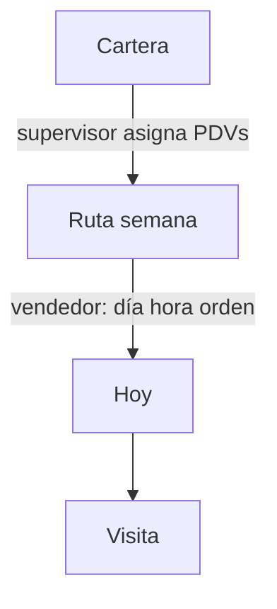

# Fase 5 — Ruta semanal

**Estado:** SF-5.0 brújula + **SF-5.1** modelo/API + tarjetas supervisor (2026-08-14).  
**Decisiones:** 4, 17, 18, 21 en [`docs/DECISIONES_Y_ROADMAP.md`](../DECISIONES_Y_ROADMAP.md) §2.1.  
**No toca:** `startVisit`, `createVisitSale`, paleta EnRutas.

Hoy “Ruta” en la UI es un **filtro de visitas del día**. No hay entidad. El vendedor y el supervisor ven visitas sueltas. Esta fase crea el contenedor.

---

## Contrato

1. **Ruta = 1 vendedor × 1 semana** (lunes→domingo, calendario Caracas).
2. **Cartera ≠ ruta.** Cartera = PDVs que le pertenecen. Ruta = a quién visita **esta semana**.
3. **Parada = `Visit`.** No duplicar un “RouteStop” paralelo si se puede colgar `route_id` + `sequence` + `schedule_locked` en la visita.
4. **Supervisor = quién** (y puede fijar cuándo). **Vendedor = orden y días** de lo no candado. Extra de cartera permitido, marcado origen vendedor.
5. **Ejecución = el día.** Inicio, mapa y “en curso” usan el slice de hoy. La semana se ve en la pantalla Ruta.
6. **Código corto opcional** (`RUT-47`). Título: `Marina · 11–17 ago` (lunes–domingo). No `RUT-004873345`.
7. Desasignar / cancelar planificada **no borra** `en_curso` / `completada`.



---

## UI

### Vendedor

| Pantalla | Qué muestra |
|----------|-------------|
| Inicio | Progreso **semana** + paradas de **hoy** (filas SF-4.3) |
| Ruta | `WeekNav` + `WeekDayStrip` (L–D + Sin día; punto = hay paradas). Mapa = trazo de hoy |
| Visitas | Bitácora (abiertas / hechas / canceladas) |

Candado en la fila = horario fijo del supervisor. Extra = lo agregó el vendedor.

### Supervisor

| Pantalla | Qué muestra |
|----------|-------------|
| Ruta | **Una tarjeta por vendedor** (Marina 8/12). Tap = `WeekDayStrip` de su semana |
| Asignar | Meter PDVs a esa semana; día / hora / candado opcionales |
| Visitas | Hechos del equipo |
| Mapa | Día de un vendedor, mismo orden que su slice de hoy |

---

## Modelo tentativo (cuando toque código)

```
Route
  id
  seller_id
  week_start        # lunes Caracas
  name?             # "Lara Centro" o auto "Marina · 11–17 ago"
  code?             # RUT-47 secuencial
  status            # borrador | publicada | en_curso | cerrada

Visit  (parada)
  route_id?         # null = visita suelta / extra fuera de plan
  sequence?
  schedule_locked   # supervisor fijó día+hora
  origin_plan       # supervisor | vendedor
  scheduled_date?   # null = Sin día
  scheduled_time?
```

Una sola ruta activa por vendedor y semana. Visita walk-in (sin plan) sigue existiendo.

---

## Relación con Fase 4

SF-4.3–4.8 homogeneizan la **visita** y el mapa del **día**. Eso es el slice de lo que aquí será la ruta. No abrir entidad `Route` a mitad de 4.x.

Cuando Fase 4 esté lista: SF-5.0 brújula (este archivo ya vale) → modelo/API → UI supervisor tarjetas → UI vendedor semana → candado y extras.

---

## SF-5.1 — Modelo, API y tarjetas supervisor

**Objetivo:** la ruta existe como entidad (1 vendedor × 1 semana). El supervisor ve tarjetas, no un listado mezclado del día.

### Qué se hizo

- Tabla `routes` + columnas en `visits`: `route_id`, `sequence`, `schedule_locked`, `origin_plan`.
- `GET /api/routes?week_start=` crea/rellena la semana (backfill de visitas con fecha).
- `GET /api/routes/{id}`, `GET /api/routes/current`, `POST /api/routes`.
- `POST /api/visits/assign` cuelga la parada en esa semana (`origin_plan=supervisor`). Día/hora/candado opcionales; `scheduled_date` null = Sin día.
- Alta de visita del vendedor se cuelga en la semana actual (`origin_plan=vendedor`).
- Supervisor `/sup/ruta`: una tarjeta por vendedor (`Marina 8/12`). Tap = L–D + Sin día + `VisitRow`.
- Inicio vendedor: línea **Semana N de M** sin cambiar el slice de hoy.

### Cómo probarlo

1. `supervisor@` ~400 px → **Ruta**: tarjetas del equipo, no lista mezclada. Semana `11–17 ago`.
2. Tap Marina → chips Lun…Dom + Sin día. `+` mete un PDV a **esa** semana.
3. Asignar sin día: aparece en Sin día. Con hora + candado: la fila dice **Fija**.
4. `marina@` Inicio: hero del día + “Semana N de M”.
5. Quitar una **programada** no borra `en_curso` / `completada`.

### Siguiente

SF-5.2 — pantalla Ruta del vendedor (plan L–S + Sin día). El mapa sigue siendo el slice de hoy.

---

## SF-5.1b — Armar semana + avisos vendedor

**Objetivo:** el supervisor suma PDVs a un día sin un calendario mensual que se desborde; el vendedor ve la campanita.

### Qué se hizo

- `+` / **Armar**: vendedor → chips L–D + Sin día → buscar PDV. Hora y nota opcionales.
- Al asignar se crea aviso `route_assigned` para el vendedor.
- Campanita del vendedor (antes deshabilitada). Inbox `/app/avisos`.
- Calendario mensual compacto (7 columnas). Panel de avisos en portal, ancho del teléfono.

### Cómo probarlo

1. `supervisor@` Ruta → **Armar**: elige Marina, toca Vie, busca un PDV, agrega sin hora. Suma otro.
2. El mes no se corta (Sa/Do visibles si abres programar visita).
3. `marina@` campanita: “Nueva parada: …”. Marcar vista. **Ver todos los avisos**.
4. Campanita supervisor: ya no se sale de la pantalla.

---

## Qué no hacer

- Ruta-por-día como entidad distinta.
- Que el vendedor invente la semana desde cero como flujo principal.
- Código de 9 dígitos como identidad.
- Tres listados distintos (ruta / visitas / mapa) con reglas de orden diferentes.
