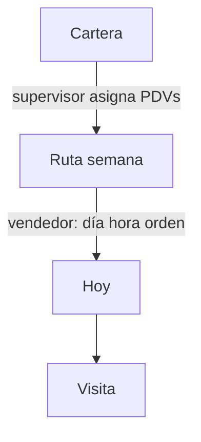

# Fase 5 — Ruta semanal

**Estado:** brújula (2026-08-13). **No implementar** hasta cerrar Fase 4 (SF-4.3 … 4.8).  
**Decisiones:** 4, 17, 18, 21 en [`docs/DECISIONES_Y_ROADMAP.md`](../DECISIONES_Y_ROADMAP.md) §2.1.  
**No toca ahora:** `startVisit`, `createVisitSale`, paleta EnRutas.

Hoy “Ruta” en la UI es un **filtro de visitas del día**. No hay entidad. El vendedor y el supervisor ven visitas sueltas. Esta fase crea el contenedor.

---

## Contrato

1. **Ruta = 1 vendedor × 1 semana** (lunes→domingo, calendario Caracas).
2. **Cartera ≠ ruta.** Cartera = PDVs que le pertenecen. Ruta = a quién visita **esta semana**.
3. **Parada = `Visit`.** No duplicar un “RouteStop” paralelo si se puede colgar `route_id` + `sequence` + `schedule_locked` en la visita.
4. **Supervisor = quién** (y puede fijar cuándo). **Vendedor = orden y días** de lo no candado. Extra de cartera permitido, marcado origen vendedor.
5. **Ejecución = el día.** Inicio, mapa y “en curso” usan el slice de hoy. La semana se ve en la pantalla Ruta.
6. **Código corto opcional** (`RUT-47`). Título: `Marina · 11–15 ago`. No `RUT-004873345`.
7. Desasignar / cancelar planificada **no borra** `en_curso` / `completada`.



---

## UI

### Vendedor

| Pantalla | Qué muestra |
|----------|-------------|
| Inicio | Progreso **semana** + paradas de **hoy** (filas SF-4.3) |
| Ruta | Plan L–S + **Sin día**. Mapa = trazo de hoy |
| Visitas | Bitácora (abiertas / hechas / canceladas) |

Candado en la fila = horario fijo del supervisor. Extra = lo agregó el vendedor.

### Supervisor

| Pantalla | Qué muestra |
|----------|-------------|
| Ruta | **Una tarjeta por vendedor** (Marina 8/12), no un listado mezclado. Tap = su semana |
| Asignar | Meter PDVs a esa semana; día / hora / candado opcionales |
| Visitas | Hechos del equipo |
| Mapa | Día de un vendedor, mismo orden que su slice de hoy |

---

## Modelo tentativo (cuando toque código)

```
Route
  id
  seller_id
  week_start        # lunes Caracas
  name?             # "Lara Centro" o auto "Marina · 11–15 ago"
  code?             # RUT-47 secuencial
  status            # borrador | publicada | en_curso | cerrada

Visit  (parada)
  route_id?         # null = visita suelta / extra fuera de plan
  sequence?
  schedule_locked   # supervisor fijó día+hora
  origin_plan       # supervisor | vendedor
  scheduled_date?   # null = Sin día
  scheduled_time?
```

Una sola ruta activa por vendedor y semana. Visita walk-in (sin plan) sigue existiendo.

---

## Relación con Fase 4

SF-4.3–4.8 homogeneizan la **visita** y el mapa del **día**. Eso es el slice de lo que aquí será la ruta. No abrir entidad `Route` a mitad de 4.x.

Cuando Fase 4 esté lista: SF-5.0 brújula (este archivo ya vale) → modelo/API → UI supervisor tarjetas → UI vendedor semana → candado y extras.

---

## Qué no hacer

- Ruta-por-día como entidad distinta.
- Que el vendedor invente la semana desde cero como flujo principal.
- Código de 9 dígitos como identidad.
- Tres listados distintos (ruta / visitas / mapa) con reglas de orden diferentes.
