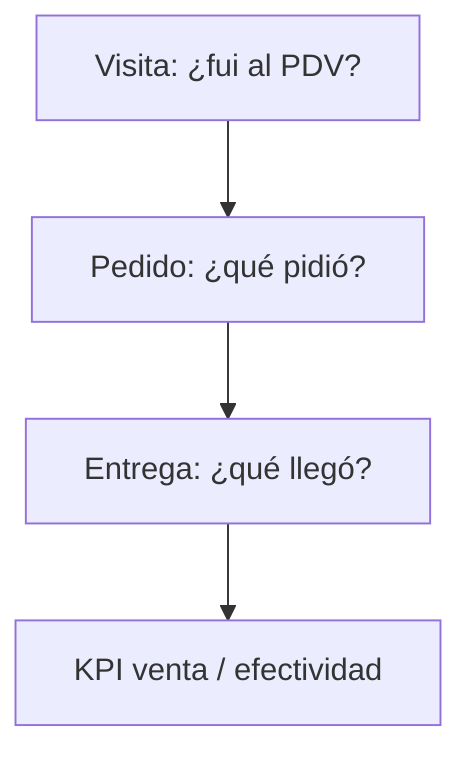
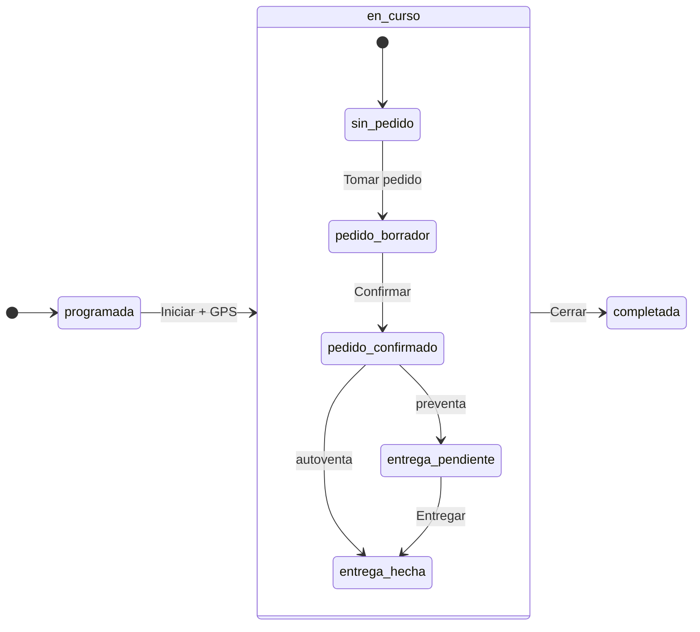

# Fase 6 — Operación camión (pedido, entrega, autoventa)

**Estado:** SF-6.0 (brújula) — 2026-08-19. Código pendiente.  
**Referencia sector:** [`docs/REFERENCIA_POWERSTREET.md`](../REFERENCIA_POWERSTREET.md)  
**No toca (en esta fase):** cobranza avanzada, comisiones, facturación fiscal, ERP.  
**No romper:** `startVisit`, `createVisitSale` (internos); migración gradual.

Hoy el producto mezcla **compromiso comercial** (pedido), **hecho físico** (entrega) y **KPI de negocio** (venta) en un solo objeto `Sale` / etiqueta “OV”. Eso sirvió para el piloto. Esta fase separa conceptos como PowerStreet / DSD, sin ERP gigante.

---

## Esfuerzo (S / M / L)

Estimado para **implementación con agente + pruebas del usuario en teléfono** — no semanas de desarrollo manual.

| Tamaño | Significado |
|--------|-------------|
| **S** | 1–2 sesiones: UI/copy, campos simples, poco backend |
| **M** | 3–5 sesiones: API + UI + offline parcial |
| **L** | Bloque grande: modelo nuevo, reglas de stock, varias pantallas |

La duración real depende de **decisiones de producto** y **pruebas en campo**, no solo de código.

---

## Glosario (UI + dominio)

| Término | Qué es | Hoy en código | Código documento |
|---------|--------|---------------|------------------|
| **Visita** | Ir al PDV; GPS; bitácora | `Visit` | — |
| **Pedido** | Compromiso: qué, cuánto, precio, moneda | `Sale` / “OV” | `PED-YYMMDD-HHMM-0001` |
| **Entrega** | Cumplimiento físico (total/parcial) | *no existe* | `ENT-…` (SF-6.3+) |
| **Autoventa** | Pedido + entrega en la **misma** visita, stock camión/bodega | OV al confirmar | `modo=autoventa` |
| **Preventa** | Solo pedido; entrega después | OV sin 2.º paso | `modo=preventa` |
| **Venta** | Métrica/KPI (“¿hubo pedido?”) — **no** pantalla principal | `SaleResult`, listados | Reportes |
| **Inventario bodega** | Stock central | `Product.stock` | UI: “Bodega” |
| **Inventario camión** | Stock cargado en la unidad del día | *no existe* | SF-6.4 |
| **Carga** | Movimiento bodega → camión | *no existe* | SF-6.4 |
| **Cierre diario** | Cuadre fin de ruta (stock camión, pedidos, entregas) | *no existe* | SF-6.6 |
| **Reparto** | Visita/ruta para entregar pedidos ya confirmados | Fase posterior | SF-6.5 |

### Renombres UI (objetivo)

| Antes | Después |
|-------|---------|
| Orden de venta / OV | **Pedido** |
| Registrar venta | **Tomar pedido** / **Autoventar** |
| Confirmar OV | **Confirmar pedido** |
| Menú Ventas | **Pedidos** |
| Inventario (vendedor) | **Disponible** (bodega; + camión en SF-6.4) |

Compatibilidad: API puede mantener `Sale` y prefijo `OV-` un tiempo; UI y códigos nuevos usan **Pedido** / `PED-`.

---

## Tres capas (modelo mental)

- **Autoventa:** V → P → E en un solo flujo (colapsado).
- **Preventa:** V → P hoy; E en otra visita o reparto (SF-6.5).

---

## Contrato de producto

1. **Una visita → un pedido** (máximo). Extras de líneas = mismo pedido.
2. **Pedido de campo** debe poder ligarse a `visit_id` (en curso o reciente).
3. **Preventa** no debe bajar stock hasta **entrega** (SF-6.3; flag de migración).
4. **Autoventa** baja stock al confirmar (hoy bodega; SF-6.4 camión).
5. **Crédito** (`is_credit`) sigue en backend; **sin** pantallas nuevas de CxC en Fase 6.
6. **Ruta semanal** (Fase 5) no se reemplaza; pedido/entrega cuelgan de **visita**.

---

## Sub-fases

### SF-6.0 — Brújula y lexicon · **S**

**Objetivo:** equipo y docs hablan igual; checklist en SUBFASES.

**Entregable:**
- Este archivo + tabla Fase 6 en `SUBFASES.md`
- Entrada en glosario `DECISIONES_Y_ROADMAP.md` §2.2
- Sin cambios de código obligatorios

**Verificación:** cualquier SF posterior referencia Pedido/Entrega/Autoventa con estas definiciones.

---

### SF-6.0b — UI: Pedido en lugar de OV · **S**

**Objetivo:** vendedor no ve “OV” en flujos principales.

**Entregable (código):**
- Copy: “Orden de venta” → “Nuevo pedido”; “Confirmar OV” → “Confirmar pedido”
- Menú y títulos: **Pedidos** (ruta puede seguir `/app/ventas` con alias)
- Códigos visibles: `PED-` (generador paralelo a `OV-`; legacy OK en listados viejos)
- Wizard visita: eyebrow “Pedido”

**Verificación:**
1. `marina@` → visita en curso → Tomar pedido: textos sin “OV”.
2. Pedidos → nueva: “Nuevo pedido”.
3. Documento/cotización puede seguir igual (SF posterior renombra si hace falta).

**Depende de:** SF-6.0.

---

### SF-6.1 — Pedido ligado a visita · **M**

**Objetivo:** trazabilidad visita ↔ pedido desde Pedidos y desde ficha.

**Entregable:**
- Crear pedido: origen **Visita | Mostrador | Online**
- Si Visita: default visita **en curso**; si no hay, picker visitas recientes del mismo cliente
- Ficha visita: Tomar pedido / Ver pedido
- Validación: pedido `origen=visita` ⇒ `visit_id` requerido

**Verificación:**
1. Pedido desde visita en curso → `visit_id` automático.
2. Pedido desde Pedidos + cliente X → elegir visita de hoy/ayer.
3. Mostrador/online → `visit_id` null.
4. Supervisor: pedido en listado muestra PDV + visita si aplica.

**Depende de:** SF-6.0b.

---

### SF-6.2 — Modo preventa / autoventa · **M**

**Objetivo:** PowerStreet-lite: distinguir intención al visitar.

**Entregable:**
- Campo `modo`: `preventa` | `autoventa` (pedido y/o visita)
- Al iniciar visita o en ficha: selector de modo (default configurable)
- Copy al confirmar: Preventa → “Confirmar pedido (entrega pendiente)”; Autoventa → “Confirmar y entregar”
- Resultado visita evolucionado: `sin_pedido` | `pedido_preventa` | `pedido_autoventa` (alias de `sin_venta` / `venta_*` durante transición)

**Verificación:**
1. Visita preventa → pedido confirmado, sin paso entrega aún (hasta SF-6.3).
2. Visita autoventa → mismo wizard, etiqueta distinta.
3. Listado visitas / supervisor distingue modo.

**Depende de:** SF-6.1.  
**Decisión requerida:** default del vendedor (¿siempre autoventa en refrescos?).

---

### SF-6.3 — Estados del pedido + entrega mínima · **L**

**Objetivo:** pedido ≠ entrega; POD simple.

**Entregable:**
- Estados pedido: `borrador` → `confirmado` → `en_ruta` → `entregado` | `entregado_parcial` | `cancelado`
- Entidad **Entrega** (`Delivery`): líneas pedidas vs entregadas; GPS; foto opcional
- Autoventa: entrega automática `completa` al confirmar
- Preventa: entrega en visita posterior o acción “Entregar pedido”
- Stock: bodega baja en **entrega**, no en confirmación preventa (`STOCK_ON_DELIVERY` flag)

**Verificación:**
1. Preventa confirmada → stock bodega **sin** cambio hasta entrega.
2. Autoventa → stock baja al confirmar (comportamiento actual, explícito).
3. Entrega parcial: líneas distintas pedido vs entregado.
4. GPS en entrega (reutilizar “¿Estás aquí?”).

**Depende de:** SF-6.2.  
**Decisión requerida:** ¿entrega parcial v1 o solo total?

---

### SF-6.4 — Inventario camión + carga · **L**

**Objetivo:** stock real del camión (refrescos/lácteos).

**Entregable:**
- `Camion` / unidad; `CargaDiaria`; `StockCamion` (producto × qty × vendedor × fecha)
- Supervisor/bodega: **Cargar camión** (movimiento bodega → camión)
- Vendedor: “Mi camión hoy” (lectura)
- Autoventa descuenta **camión**; devolución camión → bodega (mermas)

**Verificación:**
1. No autoventar más unidades de las cargadas.
2. Carga refleja movimiento en bodega global.
3. Fin de día: stock camión visible.

**Depende de:** SF-6.3 (o SF-6.2 si solo autoventa sin entrega separada en v1 camión).

---

### SF-6.5 — Reparto (opcional) · **M–L**

**Objetivo:** entregar pedidos preventa en ruta dedicada.

**Entregable:**
- Lista pedidos `confirmados` por día/ruta
- Visita tipo **Reparto**: solo entregas pendientes del PDV
- Mapa: PDV + pendientes

**Verificación:** pedido preventa de ayer → entrega hoy en visita reparto.

**Depende de:** SF-6.3. **Posponer** si piloto es solo autoventa.

---

### SF-6.6 — Cierre diario · **M**

**Objetivo:** liquidación operativa sin CxC profunda.

**Entregable:**
- Pantalla **Cierre del día**: visitas, pedidos, entregas, stock camión restante
- Devolución / conteo lo que volvió
- Resumen supervisor por vendedor
- *(Fase 7)* arqueo efectivo / abonos

**Verificación:**
1. Vendedor cierra día con resumen coherente con pedidos del día.
2. Supervisor ve carga vs vendido vs devuelto (si SF-6.4).

**Depende de:** SF-6.4 recomendado; mínimo SF-6.1 para contar pedidos.

---

## Fase 7 — Fuera de alcance (referencia)

Cobranza en campo, límite crédito, aging CxC, comisiones, facturación fiscal VE, pedido sugerido, imperdonables, SmartRouting.

---

## Migración técnica (orden)

1. UI + `PED-` (SF-6.0b) — sin romper API `Sale`.
2. `visit_id` + origen visita obligatorio en campo (SF-6.1).
3. `modo` preventa/autoventa (SF-6.2).
4. Tabla `Delivery` + estados + stock on delivery (SF-6.3).
5. Tablas camión (SF-6.4).
6. Renombrar `Sale` → `Order` en DB solo con Alembic (SF-3.5) cuando esté maduro.

---

## Diagrama de estados (visita + pedido)

---

## Qué no hacer

- Renombrar tablas DB antes de UI estable (SF-6.0b primero).
- Mezclar SF-6.3 (entrega) con SF-6.4 (camión) en un solo commit.
- Abrir cobranza/comisiones en la misma fase.
- Inventar visita falsa para mostrador/online.

---

## Orden de implementación recomendado

1. **SF-6.0** (este doc) ✓  
2. **SF-6.0b** — lexicon UI  
3. **SF-6.1** — pedido ↔ visita  
4. Terminar pulido carrito/pago (rama `ov-carrito-paso1`) antes de SF-6.2  
5. **SF-6.2** → **SF-6.3** → **SF-6.4** → **SF-6.6**  
6. **SF-6.5** solo si el cliente confirma preventa + reparto separado  

---

## Relación con fases anteriores

| Fase | Relación |
|------|----------|
| Fase 1 | Visitas + GPS = base de SF-6.1 evidencia |
| Fase 5 | Ruta semanal = **quién** visitar; Fase 6 = **qué pasa** en la visita (pedido/entrega) |
| Fase 3 | Crédito/CxC supervisor queda; Fase 7 lo lleva a campo |
| Fase 4 | Wizard 1-2-3 se reusa; solo cambian nombres y pasos según modo |
